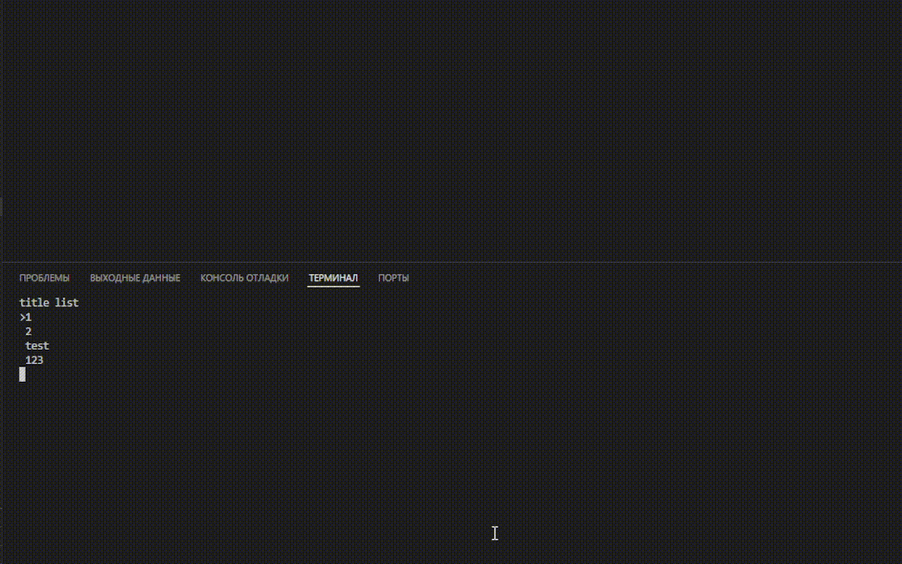
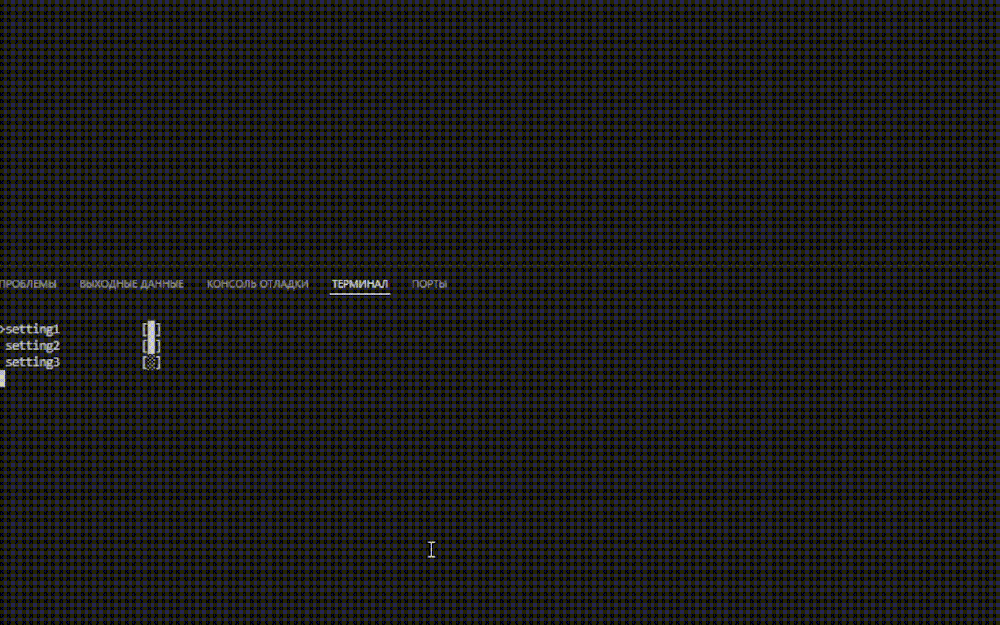

</details><details>
  <summary>languages</summary>
  <ol>
    <li>
      <ul>
      <li><a href="https://github.com/">English</a></li>
      </ul>
    </li>
</details>

TPG - terminal python graphics (UI)<br>
небольшая библиотека для создания графических интерфейсов 
в функционал библиотеки входят :
- списки
- упрощеная работа с цветами (ANSI)
- упровление курсором кансоли
- меню выбора (да/нет)
- настройки с потдержкой json
примеры и базовый функционал<br>
упровление: перемещение курсора в верх в низ стрелки, выбор - enter<br>
<h3>listgr:</h3>

```python
from tpg import *
out_point=listgr(['point1','point2','point3'])
print(out_point)
```

аргументы:<br>
kastor - параметре отвечающий за курсор стоящий перед выбранным пунктом (по умолчанию '>')<br>
title - текст над списком <br>
style - стиль по умолчанию 'standart' другие 'scob'<br>
управление: перемещение курсора в верх в низ стрелки,изменение - enter,заверщение - esc<br>
ansi - возможность использовать ANSI escape sequences в меню достаточно лишь передать ANSI последовательность советую использовать функцию `color` описанную ниже <br>
как это выгледит



<h3>settings:</h3>

```python 
from tpg import * #inport lib

out=settings({'point1':true,'point2':false}) # change dict
print(out) # print new dict from json file

out=settings({},jsonf='test_json.json')# read and write json file 

print(out) # print new dict 

```


в 1 случае в функцию был передан словарь он может быть с любыми ключами и их количеством но  
значения должно быть true или false функция вернет обновлённый словарь измененый пользователем<br><br>
во 2 случае словарь извлекается из json файла его име указывается в аргументе `jsonf` после пользовательских изменений json файл будет изменен а функция вернёт словарь с изменёнными данными из json

<h3>yes_or_no:</h3>

```python
from tpg import * #inport libs

if yes_or_no('yes or no'): # yes - True no -false 
    print("press yes") 
else:
    print('press no')  
```
передаеться 1 аргумент отвечающий за натрись в верху <br> 
возврощаеться True если выбрано yes и false если no 

<h3>color:</h3>

```python
from tpg import * #inport libs

# color color/цвет,stule/стиль,beggraubd/задний фон
print(color('red','standart','yelou')+'green text,yelou begraund') 
print(color('clear')) # clear colors очистка цветов 
print('text')
```

есть цвета : <br> 
blak <br> 
red <br> 
green <br> 
yelou <br> 
blue <br> 
violet <br> 
beruza <br> 
white <br> 
подходят как для заднего фона так и для цвета текста 


