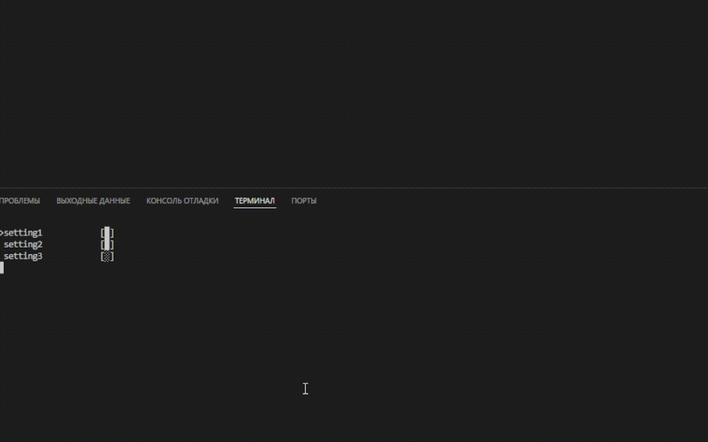

TPG - Terminal Python Graphics (UI)
A lightweight library for creating graphical user interfaces in the terminal.

The library's functionality includes:

· Lists
· Simplified color handling (ANSI)
· Console cursor control
· Selection menus (yes/no)
· JSON-supported settings

Examples and basic functionality:
Control: move cursor up/down with arrow keys, select with Enter.

---

listgr:

```python
import tpg # import library
out_point = listgr(['point1', 'point2', 'point3'])
print(out_point)
```

Arguments:
kastor - parameter for the cursor symbol displayed before the selected item (default is '>')
title - text displayed above the list
style - display style, default is 'standart', other option is 'scob'

Control: move cursor up/down with arrow keys, change selection with Enter, exit with Esc.

ansi - enables using ANSI escape sequences in the menu. Just pass an ANSI sequence (recommended to use the color function described below).

What it looks like:


settings:

```python
import tpg # import library

out = settings({'point1': True, 'point2': False}) # change dict
print(out) # print updated dict from json file

out = settings({}, jsonf='test_json.json') # read and write json file

print(out) # print new dict
```




In the first case, a dictionary is passed to the function. It can have any keys and quantity, but the values must be true or false. The function returns the dictionary updated by the user.

In the second case, the dictionary is loaded from a JSON file specified in the jsonf argument. After user modifications, the JSON file will be updated, and the function will return a dictionary with the modified data from the JSON.

yes_or_no:

```python
import tpg # import library

if yes_or_no('yes or no'): # yes - True, no - False
    print("pressed yes")
else:
    print('pressed no')
```

Accepts 1 argument for the prompt text at the top.
Returns True if "yes" is selected, and False if "no" is selected.

color:

```python
from tpg import * # import library

# color color, style, background
print(color("green text, yellow background", 'red', 'standart', 'yellow'))
print('text')
```

Available colors:

· black
· red
· green
· yellow
· blue
· violet
· cyan
· white

Suitable for both background and text color.

display class:

Functions:

· cursor
· echo
· box

Examples:

Output text at specific coordinates:

```python
import tpg

display = tpg.display()

display.cursor(5, 5)

display.echo()
```

Output 2 rectangles (squares with specified properties), one containing text and the other filled:

```python
import tpg

display = tpg.display()

display.box(15, 11, 1, 1, blok='@')

display.box(15, 11, 22, 1, filling=True)

display.cursor(3, 3, symbol='hi')

display.echo(end='\n')
```